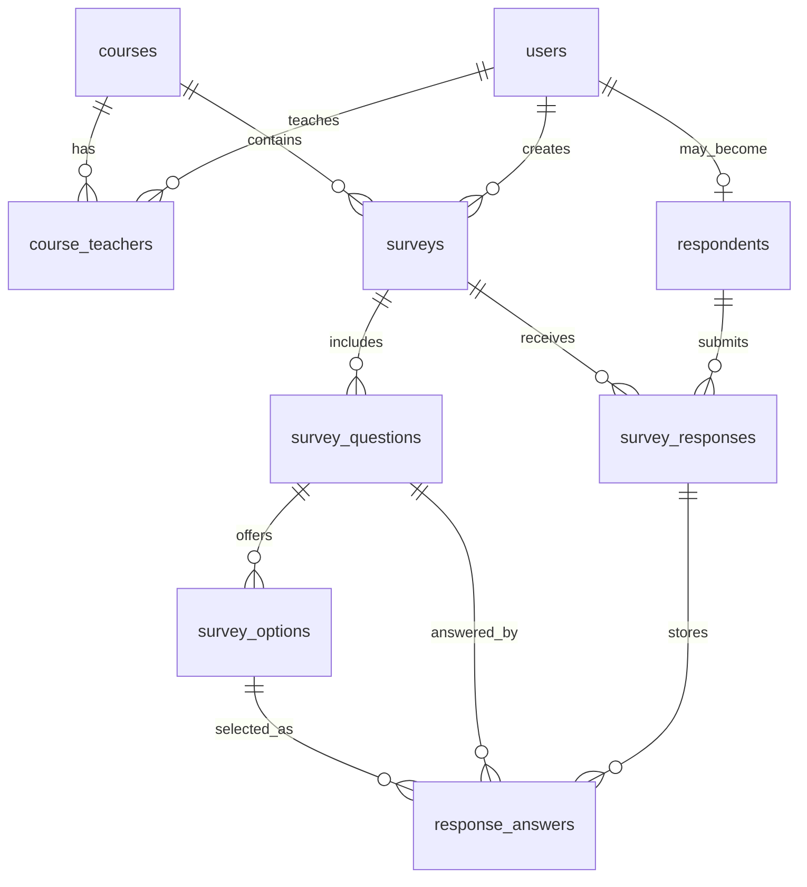

# Project Documentation

## 1. Project Overview

The Course Evaluation Survey System is a web-based application for collecting and analyzing feedback about academic courses and teaching. It supports several actors in the evaluation process:

- Administrator
- Survey Initiator
- Teacher
- Respondent

The system was implemented using Spring MVC, JSP, JSTL, Spring JDBC, and MySQL.

## 2. Scenario Summary

At the end of each academic term, institutions need a structured way to gather feedback from students and other participants. This project digitizes that workflow by allowing course-linked surveys to be published online and answered by authenticated users or guest respondents.

## 3. User Roles and Responsibilities

### 3.1 Administrator

- Approves or rejects teacher registrations
- Creates, updates, views, and deletes courses
- Assigns teachers to courses
- Views all users and surveys in the platform

### 3.2 Survey Initiator

- Creates surveys for specific courses
- Adds questions and predefined options
- Sets access mode for authenticated or guest respondents
- Publishes, edits, and deletes surveys
- Reviews survey results

### 3.3 Teacher

- Registers in the system
- Waits for approval before using the platform
- Views surveys related to assigned courses
- Monitors participation and results

### 3.4 Respondent

- Views published surveys
- Completes surveys
- Participates as a guest or logged-in user depending on survey rules
- Receives confirmation feedback by email when an address is available

## 4. Functional Requirements Coverage

| Requirement | Implementation Summary |
| --- | --- |
| FR1 | Teacher registration form and account creation with pending status |
| FR2 | Admin teacher approval and rejection actions |
| FR3 | Course CRUD in the admin module |
| FR4 | Teacher assignment page for each course |
| FR5 | Survey creation linked to courses |
| FR6 | Question management per survey |
| FR7 | Option management per question |
| FR8 | Access mode selection: `AUTHENTICATED` or `GUEST_ALLOWED` |
| FR9 | Published survey list for teachers and respondents |
| FR10 | Respondent survey submission workflow |
| FR11 | Email confirmation service with SMTP support and safe log fallback |
| FR12 | Result summaries for initiators and teachers |
| FR13 | Survey editing interface |
| FR14 | Survey deletion action |
| FR15 | Teacher dashboard for related surveys |
| FR16 | Initiator dashboard for created surveys |

## 5. System Architecture

The application follows a layered Spring MVC architecture:

- **Controller Layer**
  Handles HTTP requests, validates role access, and forwards data to JSP views.
- **Service Layer**
  Contains business rules such as login validation, survey ownership checks, response validation, and email dispatch.
- **DAO Layer**
  Uses Spring JDBC and `JdbcTemplate` for MySQL access.
- **View Layer**
  JSP and JSTL render forms, tables, dashboards, and result pages.
- **Database Layer**
  MySQL stores users, courses, surveys, questions, options, respondents, and responses.

## 6. Key Modules

### 6.1 Authentication Module

- Login for system users
- Teacher registration with pending approval
- Session-based role awareness

### 6.2 Administration Module

- Dashboard statistics
- Teacher approval
- Course management
- Course-teacher assignment
- User and survey visibility

### 6.3 Survey Design Module

- Survey creation
- Question creation
- Option creation
- Survey publication control

### 6.4 Response Module

- Published survey discovery
- Guest or authenticated participation
- Duplicate submission prevention per respondent per survey
- Confirmation feedback after submission

### 6.5 Reporting Module

- Result aggregation per question and option
- Participation list with respondent details

## 7. Database Design

The schema is stored in `database/schema.sql`.

### Main Tables

- `users`
- `courses`
- `course_teachers`
- `surveys`
- `survey_questions`
- `survey_options`
- `respondents`
- `survey_responses`
- `response_answers`

### ERD (Mermaid)

## 8. Spring MVC Structure

### Controllers

- `HomeController`
- `AuthController`
- `AdminController`
- `InitiatorController`
- `TeacherController`
- `RespondentController`

### Services

- `AuthService`
- `AdminService`
- `SurveyService`
- `ResponseService`
- `EmailService`

### DAOs

- `UserDao`
- `CourseDao`
- `SurveyDao`
- `ResponseDao`

## 9. Screenshots

Add screenshots from your running application here before final submission. Recommended screenshots:

1. Home page
2. Teacher registration page
3. Admin course management page
4. Teacher approval page
5. Initiator survey editor
6. Respondent survey page
7. Results page

## 10. How to Run

1. Import the project into your IDE as a Maven project.
2. Run `database/schema.sql` in MySQL.
3. Edit database credentials in `src/main/resources/application.properties`.
4. Run `mvn clean package`.
5. Deploy the generated WAR to Tomcat 10.1 or another compatible Jakarta servlet container.

## 11. Demo Credentials

- Admin: `admin` / `admin123`
- Initiator: `initiator` / `initiator123`
- Teacher: `teacher` / `teacher123`
- Respondent: `student` / `respondent123`

## 12. Presentation Tips

For the 4-minute video, show:

1. Login and role navigation
2. Teacher approval
3. Course creation and assignment
4. Survey creation with questions and options
5. Respondent submission
6. Result dashboard
